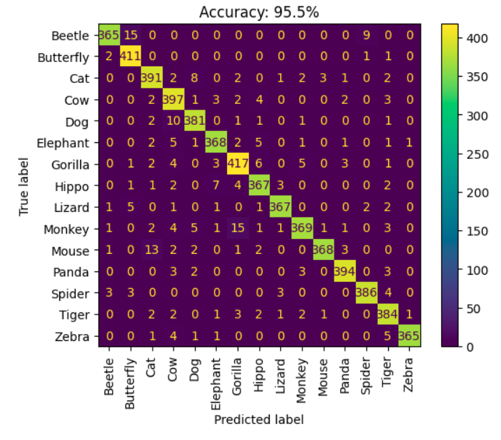

# 🐾 Animal NER + Classification Project  

This project includes two tasks:  
1. **Animal Image Classification** using a **VGG19-based model**.  
2. **Animal Named Entity Recognition (NER)** to identify animal names in text.  

---

## 📦 Installation  
To install dependencies, run:  
```bash
pip install -r requirements.txt
```

---

## 🖼️ Animal Classification  

### 📌 Model: VGG19-Based  
The classification model is based on **VGG19 with batch normalization**, fine-tuned to classify images into **15 animal categories**:  
`["Beetle", "Butterfly", "Cat", "Cow", "Dog", "Elephant", "Gorilla", "Hippo", "Lizard", "Monkey", "Mouse", "Panda", "Spider", "Tiger", "Zebra"]`  

### 📂 Dataset  
- Trained on a dataset of 15 animal species.  
- The original dataset can be found here: [Kaggle Animal Image Dataset](https://www.kaggle.com/datasets/utkarshsaxenadn/animal-image-classification-dataset/data).   

### 🚀 Training  
To train the model, run the following command:  
```bash
python train_classifier.py --lr <float> --epochs <int> --batch <int> --save <True|False> --data-dir <path_to_images> --model-path <path_to_model> --labels-path <path_to_labels>
```

### 🔍 Inference (Prediction)  
To classify an image, run:  
```bash
python inference_classifier.py --model-path <path_to_model> --labels-path <path_to_labels> --img <path_to_image> --show <True|False>
```

### Animal Classifier Evaluation

The Animal Classifier model was evaluated on a diverse dataset of animal images and achieved **95.5% accuracy**.

#### Key Observations:
- The model works exceptionally well across a wide range of animal species, correctly identifying and classifying animals from various categories.
- It performs with high accuracy, handling both common and less-common animals efficiently.

The impressive accuracy and ability to generalize across various animals suggest that the classifier is highly reliable and suitable for practical use in identifying animals from images in a variety of settings.




---

## 📝 Animal Named Entity Recognition (NER)  

The **NER model** detects **animal names in text** and differentiates between:  
- **Actual animals** (e.g., `"Tiger"` referring to the animal).  
- **Non-animal uses** (e.g., `"Tiger"` in `"Tiger Technology"`).

To generate the NER dataset, you can run the following command:
```bash
python generate_ner_data.py
```

### 📌 Model: BERT + CRF  
- **BERT** extracts contextual word embeddings.  
- **CRF (Conditional Random Field)** improves structured sequence prediction.  

### 📂 Dataset Structure  
- Data is stored in a **Pandas DataFrame** with two columns:  
  - `sentence`: The original text.  
  - `tags`: A list of BIO-format tags for each word.  
- **Most Frequent Tags**: `O`, `B-NOT_ANIMAL`, `I-NOT_ANIMAL`.  
  - `NOT_ANIMAL` is used for names of brands, teams, drinks, etc. (e.g., `"Tiger Technology"`, `"Butterfly Lounge"`).   

### 🚀 Training  
To train the NER model, run:  
```bash
python train_ner.py --lr <float> --epochs <int> --batch <int> --save <True|False> --data-dir <path_to_ner_data> --model-path <path_to_ner_model> --tags-path <path_to_tags>
```

### 🔍 Inference (Prediction)  
To recognize animals in a sentence, run:  
```bash
python inference_ner.py --model-path <path_to_ner_model> --tags-path <path_to_tags> --text <text>
```

### NER Model Evaluation  

The Named Entity Recognition (NER) model was evaluated on a test dataset, achieving **99.83% accuracy**.  

#### Key Observations:  
- The model performs exceptionally well in identifying animal-related entities while distinguishing them from non-animal references.  
- There are occasional mismatches involving the **'O' (Outside)** tag, where some non-entity words are classified differently. However, this is expected and does not significantly impact overall performance.  

The high accuracy and robust generalization indicate that the model is well-suited for practical use in identifying animal names in various contexts.


## 🐾 Final Inference: Comparing Animals from Text and Image

In this section, we will compare an animal based on both textual input and image input.

To run the model, you can use the following command line:

```bash
python inference.py --classifier <path_to_animal_classifier> --labels-path <path_to_labels> --ner <path_to_ner_model> --tags-path <path_to_tags> --img <path_to_image> --text <text_input>

```


